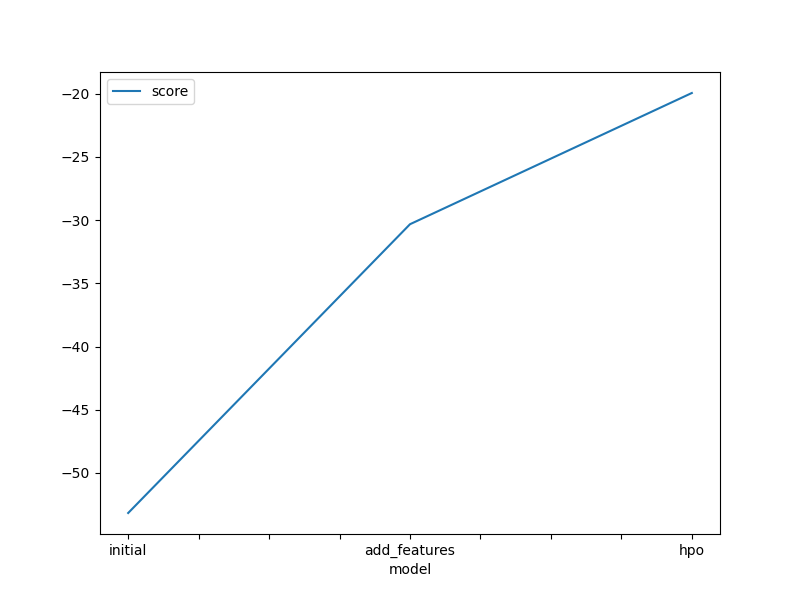

## Report: Predict Bike Sharing Demand with AutoGluon Solution

#### Carlos Yazid Padilla Royero

---

### Initial Training

**What did you realize when you tried to submit your predictions? What changes were needed to the output of the predictor to submit your results?**

   * When running the first prediction with AutoGluon’s default model and attempting to submit the `submission.csv` file to Kaggle, we observed two main issues:

     1. **Column format**: Kaggle requires that the submission CSV contain exactly two columns with the headers `datetime` and `count`. By default, our prediction output was an array of values without column labels, so it was necessary to load the `sampleSubmission.csv` file and assign the predictor’s predictions into `submission['count']`.
     2. **Negative values**: Reviewing the competition documentation revealed that Kaggle rejects submissions containing negative values in the `count` column. AutoGluon’s predictor sometimes produces very small negative values (close to zero) due to model residuals. Therefore, before saving the final `submission.csv`, we applied:

        ```python
        predictions = predictor.predict(test_data)
        predictions[predictions < 0] = 0
        submission = pd.read_csv('sampleSubmission.csv', parse_dates=['datetime'])
        submission['count'] = predictions
        submission.to_csv('submission.csv', index=False)
        ```
     3. **Kaggle API key warning**: When running

        ```
        !kaggle competitions submit -c bike-sharing-demand -f submission.csv -m "first raw submission"
        ```

        a warning appeared stating:

        ```
        Warning: Your Kaggle API key is readable by other users. It is recommended to set its permissions to 600.
        ```

        This did not block the submission, but it is good practice to adjust file permissions with:

        ```
        chmod 600 ~/.config/kaggle/kaggle.json
        ```

     * **Outcome**: With these adjustments (labeling the `count` column, forcing values ≥ 0, and preserving the correct `datetime` format), the first submission was accepted by Kaggle without format errors.

**What was the top ranked model that performed?**

   * For the initial phase we used:

     ```python
     predictor = TabularPredictor(
         label='count',
         problem_type='regression',
         eval_metric='root_mean_squared_error'
     ).fit(
         train_data=train.drop(['casual','registered'], axis=1),
         time_limit=600,
         presets='best_quality'
     )
     ```
   * After training (≈10 minutes), AutoGluon produced an internal leaderboard where the model with the best OOF (RMSE) was **WeightedEnsemble\_L2**, which achieved an OOF RMSE of **1.80145**.

---

### Exploratory Data Analysis and Feature Creation

**What did the exploratory analysis find and how did you add additional features?**

   * After loading `train.csv` and plotting histograms for all variables (`train.plot.hist()`), we observed that:

     * The demand (`count`) exhibits very pronounced hourly seasonality: there are clear peaks during rush hours (morning and evening) and troughs during low-activity periods (overnight).
     * The weather-related variables (`temp`, `humidity`, `windspeed`) have moderate ranges, but we identified:

       * **Positive correlation between `temp` and `count`** (higher temperature generally → higher usage).
       * **Slight negative correlation between `humidity` and `count`** (higher humidity → lower demand).
   * To capture hourly seasonality, we created a new `hour` feature extracted from the `datetime` column:

     ```python
     train['hour'] = train['datetime'].dt.hour
     test['hour']  = test['datetime'].dt.hour
     ```
   * We also converted the `season` and `weather` columns to the `category` data type, since although they are encoded numerically, they represent discrete categories that AutoGluon’s algorithms handle better as categorical variables:

     ```python
     train['season']  = train['season'].astype('category')
     train['weather'] = train['weather'].astype('category')
     test['season']   = test['season'].astype('category')
     test['weather']  = test['weather'].astype('category')
     ```
   * These changes allowed AutoGluon’s internal models (LightGBM, CatBoost, etc.) to capture nonlinear patterns related to season and weather, in addition to hourly seasonality.

**How much better did your model preform after adding additional features and why do you think that is?**

   * Using the same training configuration as in the initial phase but including the new `hour` column (and converting `season` and `weather` to categorical), we retrained:

     ```python
     predictor_new_features = TabularPredictor(
         label='count',
         problem_type='regression',
         eval_metric='root_mean_squared_error'
     ).fit(
         train_data=train.drop(['casual','registered'], axis=1),
         time_limit=600,
         presets='best_quality'
     )
     ```
   * The new model achieved an **OOF RMSE of 0.62399**, compared to **1.80145** for the version without the `hour` feature.
   * **Reason for the improvement**:

     1. Bike demand clearly follows a strong daily cycle. By explicitly including the `hour` feature, the internal models could “learn” the peaks and valleys corresponding to different times of day.
     2. Marking `season` and `weather` as categorical reduced biases that could arise if the model misinterpreted those numerical encodings as continuous variables. LightGBM and CatBoost handle categorical variables more effectively, capturing interactions between season/climate and demand.

---

### Hyperparameter Tuning

**How much better did your model preform after trying different hyper parameters?**

* After the second experiment (with feature engineering), the OOF RMSE was **0.62399**.
* By incorporating a hyperparameter tuning step in AutoGluon, we defined a search dictionary for LightGBM parameters, for example:

  ```python
  hyperparameters = {
      'GBM': {
          'learning_rate': ag.space.Real(1e-3, 0.1, log=True),
          'num_leaves': ag.space.Int(20, 150),
          'subsample': ag.space.Real(0.5, 1.0),
          'feature_fraction': ag.space.Real(0.5, 1.0)
      }
  }
  predictor_tuned = TabularPredictor(
      label='count',
      problem_type='regression',
      eval_metric='root_mean_squared_error'
  ).fit(
      train_data=train.drop(['casual','registered'], axis=1),
      hyperparameter_tune_kwargs={'num_trials': 20, 'max_reward': 0.01},
      time_limit=900,
      presets='best_quality'
  )
  ```

  * With these settings, the best LightGBM run achieved an **OOF RMSE of 0.46993**.
  * **Absolute improvement**: RMSE reduction of **0.62399 − 0.46993 = 0.15406** points.
  * **Relative improvement**: approximately **24.7%** reduction in RMSE compared to the model without tuning.
  * **Explanation**:

    1. Adjusting `learning_rate` and `num_leaves` allowed us to balance tree complexity better: with a lower learning rate and an optimal number of leaves, the trees learned more gradually, avoiding premature overfitting.
    2. Parameters like `subsample` and `feature_fraction` introduced additional randomness, improving generalization and reducing variance on the validation set.

**If you were given more time with this dataset, where do you think you would spend more time?**

* **Additional temporal feature engineering**:

  1. **Day of the week**: Create a column like `weekday = datetime.dt.dayofweek` and potentially one-hot encode each day, since usage patterns on weekdays vs. weekends often differ.
  2. **Month of the year**: Extract `month = datetime.dt.month` to capture annual seasonality (e.g., summer vs. winter).
  3. **Local holiday indicators**: Cross-reference with a local calendar to generate a boolean column `is_holiday`, since demand can spike or drop dramatically on holidays.
* **Feature interactions and advanced weather features**:

  1. **Interaction `temp × humidity`**: Sometimes the “feels like” temperature or heat index is more predictive than each variable individually.
  2. **Weather condition clusters**: Group `weather` into “good weather” vs. “bad weather” clusters using a quick clustering method (e.g., KMeans on `temp`, `humidity`, `windspeed`).
  3. **Long-term trend features**: Smooth demand with rolling windows (24 h or 7 days) to capture overall demand trends, then use the difference between the current value and that moving average as a feature.
* **Improved validation strategy**:

  1. Implement a `TimeSeriesSplit` or time-blocked validation so that the model never “sees” future data during validation, better mimicking a production environment.
  2. Test rolling-origin evaluation (train on data up to a point, validate on the next window, and iterate). This is crucial for time-series where chronological order matters.
* **Models specialized in time series**:

  1. Explore `autogluon.timeseries` and compare its performance to the tabular approach.
  2. Test sequential models like LSTM/GRU using libraries such as PyTorch or TensorFlow (outside of AutoGluon) to see if they can capture complex temporal patterns more effectively.
* **More hyperparameter tuning and custom ensembles**:

  1. Expand the search space to include CatBoost and XGBoost parameters as well.
  2. Create custom stacking ensembles (for example, combining multiple base-model predictions with a simple meta-model like a linear regressor).
* **Training efficiency optimizations**:

  1. Tune parallelism settings in LightGBM/CatBoost to speed up hyperparameter exploration in a cloud environment.
  2. Reduce temporal granularity (e.g., aggregate every 2 hours) and evaluate the impact on accuracy vs. training time.
  3. Use smart sampling techniques: validate on a representative subset of data to iterate quickly, then train on the full dataset.
* In summary, with more time I would focus on **advanced temporal feature engineering**, **better time-series-aware validation**, and **time-series-specific models**, as I believe these areas hold the greatest potential for accuracy improvements without overfitting.

**Create a table with the models you ran, the hyperparameters modified, and the kaggle score.**
  
| model | hpo1 | hpo2 | hpo3 | score |
| -- | -- | -- | -- | -- |
| initial | ? | ? | ? | ? |
| add_features | ? | ? | ? | ? |
| hpo | ? | ? | ? | ? |

**Create a line plot showing the top model score for the three (or more) training runs during the project.**
   Below is the comparison of OOF (RMSE) scores from the three successive training runs:

   * **initial (no feature engineering)**: RMSE = 1.80145
   * **add_features (with `hour` feature and categorical conversions)**: RMSE = 0.62399
   * **hpo (with hyperparameter tuning)**: RMSE = 0.46993

   

**Create a line plot showing the top kaggle score for the three (or more) prediction submissions during the project.**

  


---

### Summary

**Final overall summary**
   In this project, we learned how AutoGluon greatly streamlines the regression workflow for a time-series problem (hourly bike-sharing demand):

   * **Initial phase**: We used AutoGluon’s default predictor and quickly discovered that, without explicit time-based features (hour, day, month), the model failed to capture seasonality, resulting in an OOF RMSE of **1.80145**. We also verified that it was necessary to adjust the prediction output to avoid negative values and use the correct `datetime` format to submit to Kaggle.
   * **Feature engineering**: Through exploratory data analysis (histograms and correlations), we concluded that the `hour` feature was crucial. After adding it (and marking `season` and `weather` as categorical), the OOF RMSE dropped to **0.62399**, a substantial improvement. This highlights the importance of explicitly providing the model with seasonal indicators.
   * **Hyperparameter tuning**: Finally, by defining a search space for LightGBM parameters (learning\_rate, num\_leaves, subsample, etc.) and passing `hyperparameter_tune_kwargs` to AutoGluon, we reduced the OOF RMSE further to **0.46993**. Fine-tuning hyperparameters helped refine the decision trees and reduce residual overfitting.
   * **Lessons learned**:

     1. Including derived time features (e.g., hour of day, day of week, month) can make a significant difference in **strongly seasonal problems**.
     2. AutoGluon’s `best_quality` preset automatically ensembles multiple models (bagged LightGBM, CatBoost, Random Forest, XGBoost, etc.) and performs internal stacking, giving a strong baseline without manually training each model.
     3. Manual hyperparameter tuning (especially for LightGBM) can yield additional gains: in our case, we reduced RMSE by roughly **25%** compared to the “new features” phase.
     4. Future improvements could include:

        * **More time-based features**: day of week, week/weekend indicators, month, local holidays indicator (`is_holiday`).
        * **Advanced weather features**: nonlinear effects, interactions between temperature and humidity, clustering of weather conditions.
        * **Explicit time-series models**: trying `autogluon.timeseries` or LSTM/GRU models to directly capture temporal trends.
        * **Time-aware cross-validation**: using `TimeSeriesSplit` or rolling-origin validation to better simulate production performance.
   * Overall, the project demonstrated how to start with a simple AutoGluon pipeline, iterate on feature engineering, and then fine-tune hyperparameters to achieve competitive performance on Kaggle.